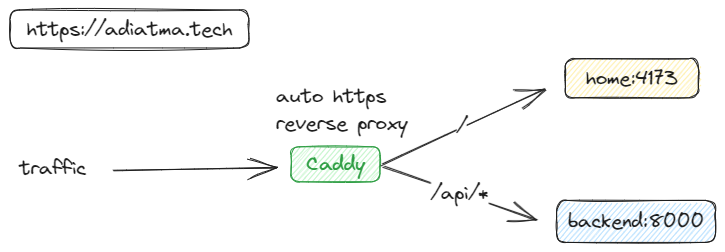

<div align="center">
    
    <h2>http://adiatma.tech</h2>
    <small>My personal site</small>
</div>

### Prerequisite

- go v1.21
- Node
- Docker
- Docker Compose

### Getting Started

```bash
# pull docker images from ghcr.io
docker compose pull

# export env
export PORT=8000
export BASE_PATH=/
export HOST=localhost:8000

# run the container
docker compose up -d
```

### Stack

- go
- Vanilla JS
- Docker
- Caddy for web server

### API's

Visit in `https://adiatma.tech/api/`

| Endpoints                            | Description |
| ------------------------------------ | ----------- |
| /api/metrics                         |             |
| /api/hadith/:author?page=1&perPage=5 |             |
| /api/list/authors                    |             |
| /api/swagger/index.html              |             |

### Home

Visit in `https://adiatma.tech`

### License

- [MIT](./LICENSE)

### Roadmap

- [x] API Hadith
- [ ] API Blogs (get data from notion, dev.to)
- [ ] Revamp Home
